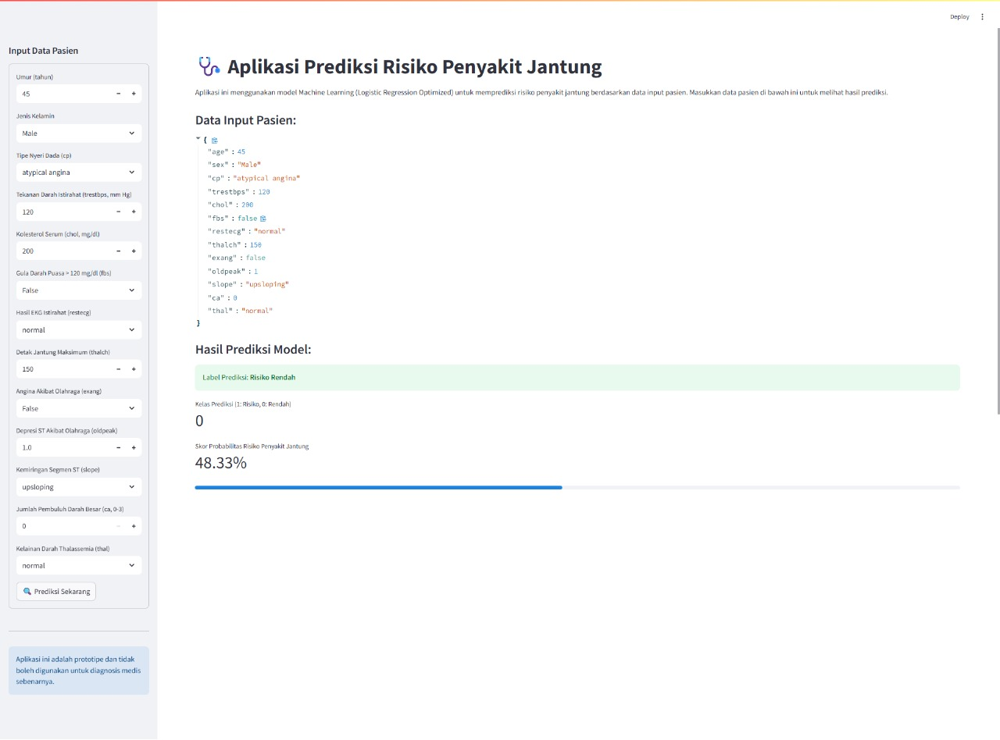
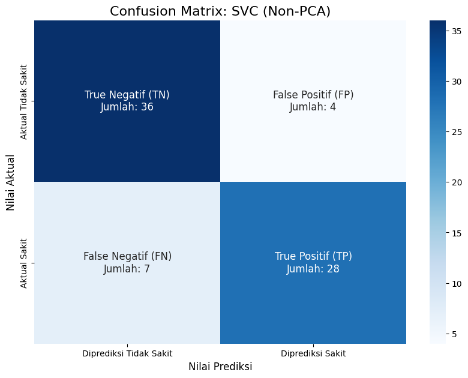
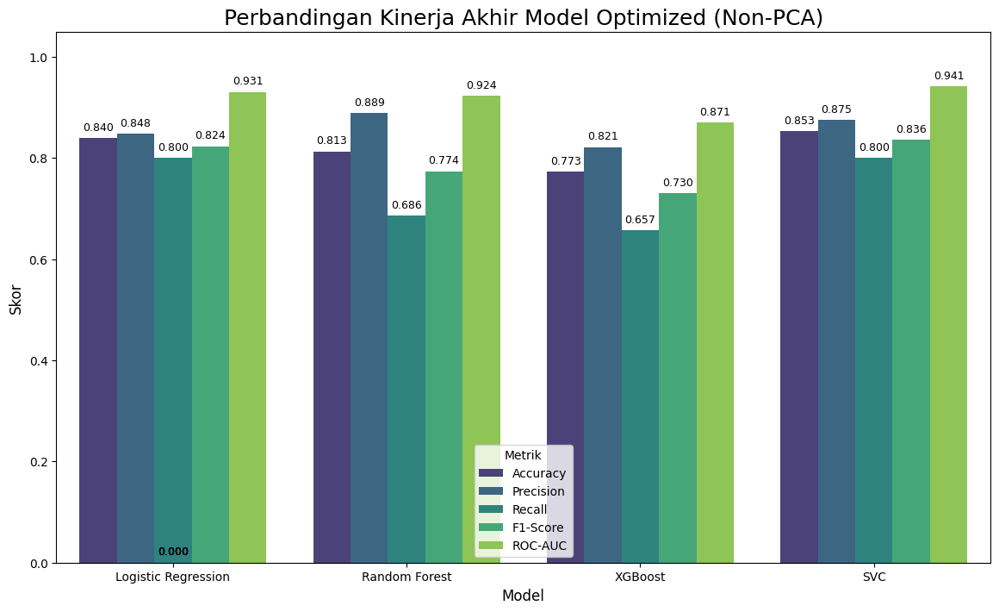

# 🩺 Aplikasi Prediksi Risiko Penyakit Jantung (v2.0)

Sebuah aplikasi web interaktif untuk memprediksi risiko penyakit jantung menggunakan berbagai model Machine Learning. Proyek ini dibangun sebagai bagian dari Ujian Akhir Semester (UAS) mata kuliah Machine Learning, menggabungkan backend API yang andal dengan frontend yang modern dan responsif.

## 🖼️ Tampilan Aplikasi



## 📝 Deskripsi Proyek

Tujuan utama proyek ini adalah untuk menganalisis dan membandingkan performa berbagai algoritma Machine Learning dalam memprediksi penyakit jantung. Proses ini mencakup pra-pemrosesan data, pelatihan model, optimasi hyperparameter, dan evaluasi mendalam untuk memilih model dengan performa terbaik.

Aplikasi ini memungkinkan pengguna untuk memasukkan data medis dan memilih salah satu dari empat model AI yang telah dilatih (Logistic Regression, Random Forest, SVC, XGBoost) untuk mendapatkan prediksi risiko penyakit jantung secara real-time.

**Dataset yang Digunakan:**

* **Nama**: Heart Disease UCI (Gabungan dari 4 sumber, difokuskan pada data bersih)
* **Sumber**: [UCI Machine Learning Repository](https://archive.ics.uci.edu/dataset/45/heart+disease)
* **Target**: Klasifikasi biner (0 = Risiko Rendah, 1 = Risiko Penyakit Jantung).

## 📂 Struktur Proyek

```

projek\_UAS/
├── backend/                  # Direktori utama yang menampung seluruh kode dan aset terkait backend proyek.
│   ├── __pycache__/          # Cache Python untuk kompilasi bytecode (dihasilkan otomatis).
│   ├── data/                 # Berisi semua dataset yang digunakan dalam proyek.
│   │   ├── dataset_prediksi_jantung_clean_dropna.csv # Dataset gabungan yang sudah dibersihkan (metode dropna).
│   │   └── heart+disease/    # Direktori yang berisi dataset mentah asli penyakit jantung (file .data).
│   ├── hasil_gambar/         # Direktori khusus untuk menyimpan semua visualisasi dan grafik hasil eksperimen.
│   │   ├── Perbandingan_Kinerja_Akhir_Non-PCA.png # Grafik perbandingan kinerja model untuk skenario Non-PCA.
│   │   ├── Perbandingan_Kinerja_Akhir_PCA.png     # Grafik perbandingan kinerja model untuk skenario PCA.
│   │   └── confusion_matrix/ # Subdirektori ini menyimpan semua gambar Confusion Matrix dari model.
│   ├── hasil_model/          # **[Catatan: Ini adalah lokasi penyimpanan model .pkl Anda saat ini.]**
│   │   │                     # Berisi model-model yang telah dilatih (Non-PCA & PCA) dalam struktur datar.
│   │   ├── Non-PCA_Logistic_Regression_model.pkl
│   │   └── ... (file model .pkl lainnya)
│   ├── models/               # Direktori alternatif (dan direkomendasikan) untuk menyimpan model Machine Learning.
│   │   └── jantung/
│   │       ├── belum-optimize/  # Model dasar (sebelum dioptimasi) dan gambar Confusion Matrix terkait.
│   │       │   └── ... (model .pkl dan gambar CM dasar)
│   │       └── optimize_pca/    # Model hasil optimasi dengan PCA dan gambar Confusion Matrix terkait.
│   │           └── ... (model .pkl dan gambar CM optimized)
│   ├── training/             # Direktori untuk menyimpan data uji (X_test, y_test) yang telah dipreproses.
│   │   ├── X_test_non_pca.csv # Data uji setelah preprocessing tanpa PCA.
│   │   ├── X_test_pca.csv     # Data uji setelah preprocessing dengan PCA.
│   │   ├── y_test_non_pca.csv
│   │   └── y_test_pca.csv
│   └── modelling.ipynb 
├── frontend/
│   ├── public/
│   ├── src/
│   │   ├── components/
│   │   │   ├── HeartPredictionForm.tsx
│   │   │   └── PredictionResult.tsx
│   │   └── pages/
│   │       └── Index.tsx
│   ├── package.json               \# KTP & skrip proyek frontend
│   └── ... (file konfigurasi lainnya)
├── venv/                          \# Virtual environment Python (di luar folder ini)
├── main.py                          \# sebagai script API Flask
└── README.md                      \# File ini

````

## 🛠️ Tumpukan Teknologi (Tech Stack)

### Backend

* **Bahasa**: Python 3.10+
* **Framework API**: **Flask**
* **Server WSGI**: Werkzeug (Development Server bawaan Flask)
* **Machine Learning**: Scikit-learn, XGBoost
* **Data Handling**: Pandas, NumPy

### Frontend

* **Framework**: React.js
* **Bahasa**: TypeScript
* **Build Tool**: Vite
* **Styling**: Tailwind CSS
* **UI Components**: shadcn/ui
* **HTTP Client**: Axios

## ⚙️ Instalasi dan Cara Menjalankan

### Prasyarat

* Node.js (versi 18 atau lebih baru)
* Python (versi 3.10 atau lebih baru)
* Git

### 1. Setup Proyek

```bash
# Clone repositori
git clone [https://github.com/LycusCoder/ANALISIS-PREDIKTIF-PENYAKIT-JANTUNG.git](https://github.com/LycusCoder/ANALISIS-PREDIKTIF-PENYAKIT-JANTUNG.git)
cd ANALISIS-PREDIKTIF-PENYAKIT-JANTUNG

# Setup virtual environment untuk Python di luar folder proyek
python -m venv venv 
# (Sesuaikan path jika perlu)

# Aktifkan virtual environment
# Windows:
# venv/Scripts/activate
# GitBash:
# source venv/scripts/activate
# macOS/Linux:
# source venv/bin/activate

# Install dependencies untuk backend dari dalam folder 'backend'
cd backend
pip install -r requirements.txt
cd ..

# Install dependencies untuk frontend dari dalam folder 'frontend'
cd frontend
npm install
````

*(Catatan: Buat file `requirements.txt` di folder `backend` dengan isi: `Flask`, `Flask-Cors`, `pandas`, `numpy`, `scikit-learn`, `xgboost`)*

### 2\. Menjalankan Aplikasi (Cara Mudah)

Kita menggunakan `concurrently` untuk menjalankan backend dan frontend sekaligus dari satu terminal.

```bash
# Pastikan Anda berada di dalam direktori 'frontend'
cd frontend

# Jalankan kedua server dengan satu perintah
npm run start:dev
```

Aplikasi akan otomatis berjalan dan bisa diakses di alamat yang ditampilkan oleh Vite (biasanya `http://localhost:5173` atau `http://localhost:8080`).

## 📈 Hasil Evaluasi & Performa Model

Setelah melakukan perbandingan antara 4 model yang telah dioptimasi dalam dua skenario (Non-PCA dan PCA), **Support Vector Classifier (SVC)** dari **skenario Non-PCA** terpilih sebagai model terbaik untuk di-*deploy*. Model ini menunjukkan akurasi tertinggi serta keseimbangan performa yang paling unggul pada data uji.

### Model Terbaik: SVC (Optimized, Non-PCA)

Berikut adalah rincian performa dari model SVC yang terpilih:

  * **Accuracy**: `0.853` (Prediksi benar tertinggi secara keseluruhan)
  * **F1-Score**: `0.836` (Keseimbangan terbaik antara Precision & Recall)
  * **ROC-AUC**: `0.941` (Kemampuan membedakan kelas yang sangat baik)
  * **Recall** (Sensitivitas): `0.800`
  * **Precision** (Akurasi Prediksi Positif): `0.875`

#### Confusion Matrix (Model Juara)

  * **True Negative**: 36
  * **False Positive**: 4 (Kesalahan Tipe I: prediksi sakit, padahal tidak)
  * **False Negative**: 7 (Kesalahan Tipe II: prediksi tidak sakit, padahal sakit)
  * **True Positive**: 28



### Grafik Perbandingan Performa (Skenario Non-PCA)

Visualisasi di bawah ini merangkum perbandingan metrik evaluasi utama antara keempat model pada skenario Non-PCA, yang menghasilkan performa terbaik.



### Perbandingan dengan Model Lain (Skenario Non-PCA)

Tabel berikut merangkum performa dari semua model yang diuji pada skenario Non-PCA.

| Model | F1-Score | ROC-AUC | Recall | Precision |
| :--- | :--- | :--- | :--- | :--- |
| **SVC (Juara)** | **0.836** | **0.941** | **0.800** | **0.875** |
| Logistic Regression | 0.824 | 0.931 | 0.800 | 0.848 |
| Random Forest | 0.774 | 0.924 | 0.686 | 0.889 |
| XGBoost | 0.730 | 0.871 | 0.657 | 0.821 |

*(Catatan: Angka di atas adalah hasil akhir dari skenario Non-PCA yang menunjukkan performa terbaik, dieksekusi dari notebook `modelling.ipynb`)*

## 👨‍💻 Kontributor

| Nama                         | NIM        | Peran   |
| ---------------------------- | ---------- | ------- |
| Muhammad Affif               | `24225046` | Ketua   |
| Arif Nur Syifa               | `23215054` | Anggota |
| Muhammad Yasir Ilham Nabil   | `23215040` | Anggota |
| Muhamad Djafar Ilyasa        | `23215028` | Anggota |
