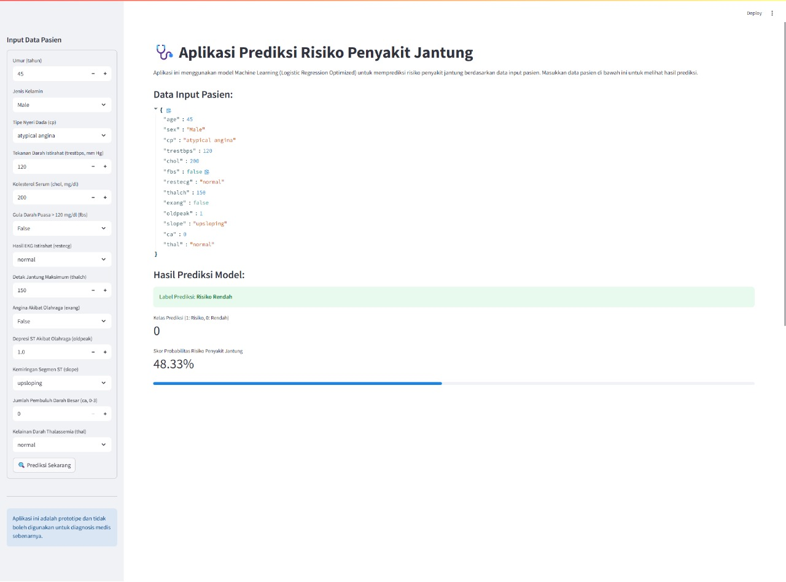

# 🩺 Aplikasi Prediksi Risiko Penyakit Jantung

Aplikasi ini adalah sebuah sistem prediksi risiko penyakit jantung yang dibangun menggunakan model Machine Learning. Proyek ini merupakan bagian dari Ujian Akhir Semester (UAS) mata kuliah Machine Learning. Aplikasi ini memungkinkan pengguna untuk memasukkan data pasien dan mendapatkan prediksi mengenai risiko penyakit jantung berdasarkan model Logistic Regression yang telah dioptimasi.

## 🖼️ Tampilan Aplikasi

 

## 📝 Deskripsi Proyek

Tujuan utama proyek ini adalah untuk menganalisis dan membandingkan performa algoritma Logistic Regression dan Random Forest dalam memprediksi penyakit jantung, serta melakukan optimasi hyperparameter untuk mendapatkan model terbaik. Model terbaik kemudian di-deploy menjadi sebuah aplikasi web interaktif.

**Dataset yang Digunakan:**
* Nama: Heart Disease UCI (Cleveland subset)
* Sumber: [Kaggle - Heart Disease UCI](https://www.kaggle.com/datasets/redwankarimsony/heart-disease-data)
* Jumlah Fitur: 13 fitur klinis (setelah pra-pemrosesan menjadi 18 fitur karena encoding).
* Target: Klasifikasi biner (0 = Risiko Rendah, 1 = Risiko Penyakit Jantung).

**Algoritma yang Digunakan dan Dievaluasi:**
1.  Logistic Regression (Dasar dan Optimasi Hyperparameter)
2.  Random Forest Classifier (Dasar dan Optimasi Hyperparameter)

**Model Terbaik untuk Deployment:**
* Berdasarkan evaluasi (ROC-AUC tertinggi), model **Logistic Regression Optimized** dipilih untuk deployment.

## 📂 Struktur Folder Proyek

projek_UAS/
|-- backend/
|   |-- data/
|   |   `-- heart_disease_uci.csv   # Dataset asli
|   |-- models/
|   |   |-- heart_disease_scaler.pkl  # Scaler yang disimpan
|   |   |-- lr_model_basic.pkl
|   |   |-- lr_model_optimized.pkl    # Model LR terbaik untuk deployment
|   |   |-- rf_model_basic.pkl
|   |   `-- rf_model_optimized.pkl
|   |-- main.py                     # Script API FastAPI
|   `-- train_model.py              # Script untuk training dan evaluasi model (bisa juga .ipynb)
|-- frontend/
|   `-- app_streamlit.py            # Script Aplikasi Streamlit
`-- README.md                       # File ini

## 🛠️ Teknologi yang Digunakan

* **Bahasa Pemrograman**: Python 3.10+
* **Data Processing & Analysis**: Pandas, NumPy
* **Machine Learning**: Scikit-learn
* **API Backend**: FastAPI
* **Server ASGI**: Uvicorn
* **Frontend UI**: Streamlit
* **Manajemen Environment (Disarankan)**: Conda atau Python venv

## ⚙️ Instalasi dan Cara Menjalankan

Pastikan kamu sudah menginstal Python (versi 3.10 atau lebih baru direkomendasikan).

1.  **Clone Repositori (jika ada di Git):**
    ```bash
    git clone [https://github.com/LycusCoder/ANALISIS-PREDIKTIF-PENYAKIT-JANTUNG.git](https://github.com/LycusCoder/ANALISIS-PREDIKTIF-PENYAKIT-JANTUNG.git)
    cd projek_UAS
    ```

2.  **Buat dan Aktifkan Virtual Environment (Sangat Direkomendasikan):**
    ```bash
    python -m venv venv
    # Windows
    venv\Scripts\activate
    # macOS/Linux
    source venv/bin/activate
    ```

3.  **Install Dependencies:**
    Buat file `requirements.txt` yang berisi:
    ```txt
    pandas
    numpy
    scikit-learn
    fastapi
    "uvicorn[standard]"
    streamlit
    pydantic
    # Tambahkan library lain jika ada (misalnya matplotlib, seaborn untuk notebook analisis)
    ```
    Lalu jalankan:
    ```bash
    pip install -r requirements.txt
    ```

4.  **Training Model (Jika ingin melatih ulang dari awal):**
    * Pastikan dataset `heart_disease_uci.csv` ada di dalam folder `backend/data/`.
    * Jalankan script training:
        ```bash
        cd backend
        python train_model.py 
        cd .. 
        ```
    * Ini akan menghasilkan file-file `.pkl` (model dan scaler) di dalam folder `backend/models/`.

5.  **Menjalankan API Backend (FastAPI):**
    * Buka terminal baru.
    * Masuk ke direktori `backend`:
        ```bash
        cd backend
        ```
    * Jalankan server Uvicorn:
        ```bash
        uvicorn main:app --reload
        ```
    * API akan berjalan di `http://127.0.0.1:8000`. Kamu bisa cek dokumentasinya di `http://127.0.0.1:8000/docs`.

6.  **Menjalankan Aplikasi Frontend (Streamlit):**
    * Pastikan API Backend sudah berjalan.
    * Buka terminal baru.
    * Masuk ke direktori `frontend`:
        ```bash
        cd frontend
        ```
    * Jalankan aplikasi Streamlit:
        ```bash
        streamlit run app_streamlit.py
        ```
    * Aplikasi frontend akan otomatis terbuka di browser (biasanya di `http://localhost:8501`).

## 📈 Hasil Evaluasi Model Terbaik (Logistic Regression Optimized)

* **Akurasi**: 0.8852
* **Presisi (kelas 1)**: 0.8621
* **Recall (kelas 1)**: 0.8929
* **F1-Score (kelas 1)**: 0.8772
* **ROC-AUC**: 0.9513
* **Confusion Matrix**:
    ```
    [[29  4]
     [ 3 25]]
    ```

## 📈 Hasil Evaluasi Model pada Test Set

Berikut adalah perbandingan hasil evaluasi untuk model Logistic Regression Optimized dan Random Forest Optimized pada data uji:

### Logistic Regression Optimized (Model Terbaik untuk Deployment)

* **Akurasi**: 0.8852
* **Presisi (kelas 1 - Risiko Penyakit Jantung)**: 0.8621
* **Recall (kelas 1 - Risiko Penyakit Jantung)**: 0.8929
* **F1-Score (kelas 1 - Risiko Penyakit Jantung)**: 0.8772
* **ROC-AUC**: 0.9513
* **Confusion Matrix**:
    ```
    [[29  4]
     [ 3 25]]
    ```
    * True Negative: 29 | False Positive: 4
    * False Negative: 3  | True Positive: 25
* **Classification Report**:
    ```
                   precision    recall  f1-score   support

               0       0.91      0.88      0.89        33
               1       0.86      0.89      0.88        28

        accuracy                           0.89        61
       macro avg       0.88      0.89      0.88        61
    weighted avg       0.89      0.89      0.89        61
    ```

### Random Forest Optimized (Sebagai Perbandingan)

* **Akurasi**: 0.8197
* **Presisi (kelas 1 - Risiko Penyakit Jantung)**: 0.7742
* **Recall (kelas 1 - Risiko Penyakit Jantung)**: 0.8571
* **F1-Score (kelas 1 - Risiko Penyakit Jantung)**: 0.8136
* **ROC-AUC**: 0.9383
* **Confusion Matrix**:
    ```
    [[26  7]
     [ 4 24]]
    ```
    * True Negative: 26 | False Positive: 7
    * False Negative: 4  | True Positive: 24
* **Classification Report**:
    ```
                   precision    recall  f1-score   support

               0       0.87      0.79      0.83        33
               1       0.77      0.86      0.81        28

        accuracy                           0.82        61
       macro avg       0.82      0.82      0.82        61
    weighted avg       0.82      0.82      0.82        61
    ```

**Kesimpulan Pemilihan Model:**
Berdasarkan metrik ROC-AUC pada data uji, **Logistic Regression Optimized (ROC-AUC: 0.9513)** menunjukkan performa yang lebih unggul dibandingkan Random Forest Optimized (ROC-AUC: 0.9383) dan dipilih sebagai model utama untuk deployment aplikasi ini.

## 👨‍💻 Kontributor

* **Muhammad Affif** - [24225046] - [Ketua]
* **Arif Nur Syifa** - [24225046] - [Anggota]
* **Muhammad Yasir Ilham Nabil** - [24225046] - [Anggota]
* **Djafar Ilyasa** - [24225046] - [Anggota]

