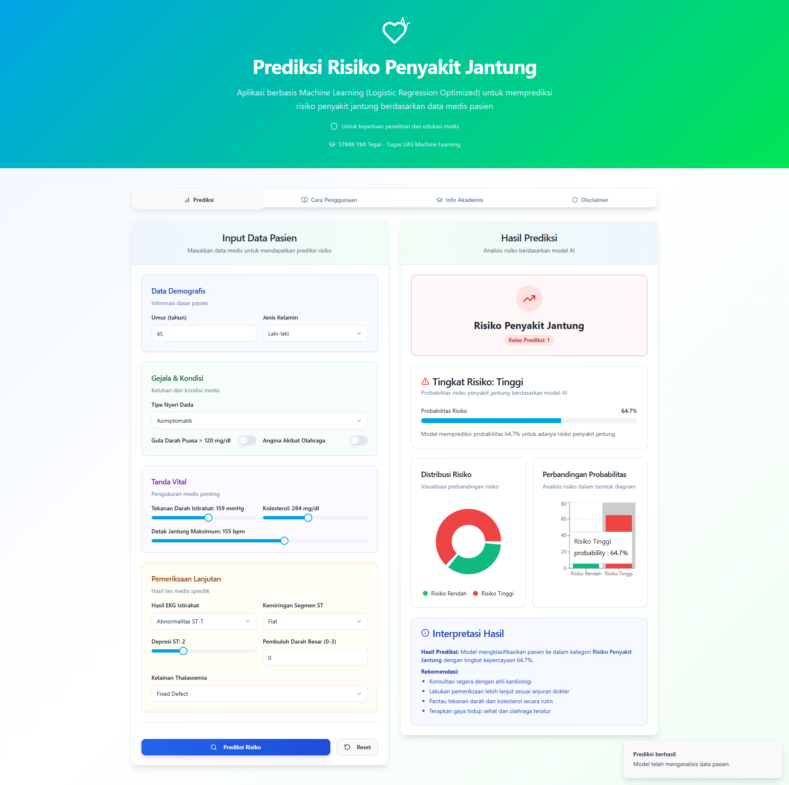

# 🩺 Aplikasi Prediksi Risiko Penyakit Jantung

Sebuah aplikasi web interaktif untuk memprediksi risiko penyakit jantung menggunakan model Machine Learning. Proyek ini dibangun sebagai bagian dari Ujian Akhir Semester (UAS) mata kuliah Machine Learning, menggabungkan backend API yang andal dengan frontend yang modern dan responsif.

## 🖼️ Tampilan Aplikasi




## 📝 Deskripsi Proyek

Tujuan utama proyek ini adalah untuk menganalisis dan membandingkan performa berbagai algoritma Machine Learning dalam memprediksi penyakit jantung. Proses ini mencakup pra-pemrosesan data, pelatihan model, optimasi hyperparameter, dan evaluasi mendalam untuk memilih model dengan performa terbaik.

Model yang terpilih kemudian di-deploy ke dalam arsitektur aplikasi web modern yang terdiri dari:

  * **Backend**: Sebuah REST API yang dibuat dengan **FastAPI** untuk menangani logika machine learning dan menyajikan prediksi.
  * **Frontend**: Sebuah *Single Page Application* (SPA) yang dibuat dengan **React** untuk menyediakan antarmuka pengguna yang dinamis dan interaktif.

**Dataset yang Digunakan:**

  * **Nama**: Heart Disease UCI (Cleveland subset)
  * **Sumber**: [Kaggle - Heart Disease UCI](https://www.kaggle.com/datasets/redwankarimsony/heart-disease-data)
  * **Target**: Klasifikasi biner (0 = Risiko Rendah, 1 = Risiko Penyakit Jantung).

## 📂 Struktur Proyek

```

projek\_UAS/
|
|-- backend/
|   |-- data/
|   |   ` -- heart_disease_uci.csv   # Dataset asli |   |-- models/ |   |   |-- heart_disease_scaler.pkl  # Scaler yang disimpan |   |    `-- lr\_model\_optimized.pkl    \# Model terbaik untuk deployment
|   |-- main.py                     \# Script API FastAPI
|   ` -- train_model.ipynb           # Notebook untuk training & evaluasi | |-- frontend/ |   |-- public/ |   |-- src/                        # Kode sumber komponen React |   |   |-- App.tsx                 # Komponen utama aplikasi |   |   |-- components/             # Komponen UI (form, hasil, dll) |   |    `-- main.tsx                \# Titik masuk aplikasi React
|   |-- index.html                  \# Template HTML utama
|   |-- package.json                \# KTP & skrip proyek frontend
|   ` -- vite.config.ts              # Konfigurasi Vite | |-- gambar/ |    `-- tampilan\_aplikasi.jpg
|
\`-- README.md                       \# File ini

````

## 🛠️ Tumpukan Teknologi (Tech Stack)

### Backend

  * **Bahasa**: Python 3.10+
  * **Framework API**: FastAPI
  * **Server ASGI**: Uvicorn
  * **Machine Learning**: Scikit-learn
  * **Data Handling**: Pandas, NumPy

### Frontend

  * **Framework**: React.js
  * **Bahasa**: TypeScript
  * **Build Tool**: Vite
  * **Styling**: Tailwind CSS
  * **UI Components**: shadcn/ui
  * **State Management**: TanStack Query (untuk fetching data API)
  * **Form**: React Hook Form & Zod

## ⚙️ Instalasi dan Cara Menjalankan

### Prasyarat

  * Node.js (versi 18 atau lebih baru)
  * Python (versi 3.10 atau lebih baru)
  * Git

### 1\. Setup Proyek

```bash
# Clone repositori
git clone [https://github.com/LycusCoder/ANALISIS-PREDIKTIF-PENYAKIT-JANTUNG.git](https://github.com/LycusCoder/ANALISIS-PREDIKTIF-PENYAKIT-JANTUNG.git)
cd ANALISIS-PREDIKTIF-PENYAKIT-JANTUNG

# Setup virtual environment untuk Python (sangat disarankan)
python -m venv venv
# Windows:
venv\Scripts\activate
# macOS/Linux:
# source venv/bin/activate

# Install dependencies untuk backend
pip install -r requirements.txt
````

### 2\. Menjalankan Backend (API)

Buka terminal **pertama**, pastikan venv aktif, lalu jalankan:

```bash
# Masuk ke direktori backend
cd backend

# Jalankan server API dengan Uvicorn
uvicorn main:app --reload
```

API akan berjalan di `http://127.0.0.1:8000`. Anda bisa cek dokumentasi interaktifnya di `http://127.0.0.1:8000/docs`.

### 3\. Menjalankan Frontend (Aplikasi Web)

Buka terminal **kedua**, lalu jalankan:

```bash
# Masuk ke direktori frontend
cd frontend

# Install dependencies Node.js
npm install

# Jalankan server development Vite
npm run dev
```

Aplikasi web akan otomatis terbuka di browser, biasanya di `http://localhost:5173`.

## 📈 Hasil Evaluasi Model

Bagian ini merangkum perbandingan performa antara model **Logistic Regression** dan **Random Forest** setelah optimasi pada data uji.

### Model Terbaik: Logistic Regression (Optimized)

Model ini dipilih untuk deployment karena memiliki skor ROC-AUC tertinggi dan performa keseluruhan yang lebih baik.

  * **Akurasi**: `0.8852`
  * **Presisi** (Risiko): `0.8621`
  * **Recall** (Risiko): `0.8929`
  * **F1-Score** (Risiko): `0.8772`
  * **ROC-AUC**: `0.9513`
  * **Confusion Matrix**:
    ```
      Prediksi 0 | Prediksi 1
    [[    29    |      4    ]]  <- Aktual 0
    [[     3    |     25    ]]  <- Aktual 1
    ```
      * **True Negative**: 29
      * **False Positive**: 4
      * **False Negative**: 3
      * **True Positive**: 25

### Model Pembanding: Random Forest (Optimized)

  * **Akurasi**: `0.8197`
  * **Presisi** (Risiko): `0.7742`
  * **Recall** (Risiko): `0.8571`
  * **F1-Score** (Risiko): `0.8136`
  * **ROC-AUC**: `0.9383`

## 👨‍💻 Kontributor

| Nama                          | NIM         | Peran    |
| ----------------------------- | ----------- | -------- |
| Muhammad Affif                | `24225046`  | Ketua    |
| Arif Nur Syifa                | `23215054`  | Anggota  |
| Muhammad Yasir Ilham Nabil    | `23215040`  | Anggota  |
| Muhamad Djafar ilyasa         | `23215028`  | Anggota  |


