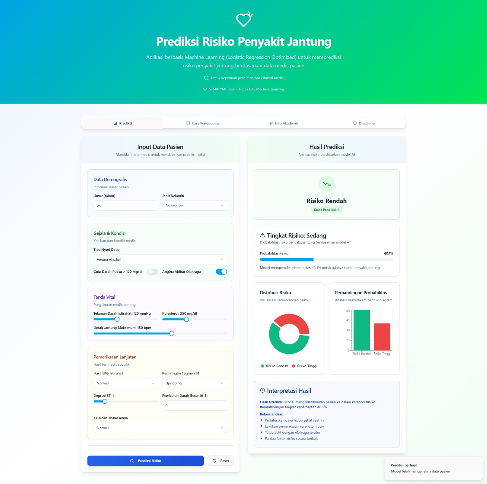

# Frontend: Aplikasi Prediksi Penyakit Jantung

Ini adalah antarmuka pengguna (frontend) untuk aplikasi web prediksi penyakit jantung. Aplikasi ini dibangun untuk menyediakan pengalaman pengguna yang interaktif dan mudah digunakan dalam memasukkan data pasien dan melihat hasil prediksi.

## Tampilan Aplikasi

 

## ✨ Fitur Utama

-   **Formulir Interaktif**: Input data pasien dengan validasi real-time untuk meminimalisir kesalahan input.
-   **Hasil Prediksi Real-time**: Menampilkan hasil prediksi risiko penyakit jantung secara langsung setelah data dikirim.
-   **Visualisasi Skor**: Menampilkan skor probabilitas dalam bentuk yang mudah dipahami (misalnya, menggunakan grafik).
-   **Desain Modern & Responsif**: Antarmuka yang bersih dan dapat diakses dengan baik di berbagai ukuran layar (desktop maupun mobile).
-   **Panduan Pengguna**: Halaman panduan singkat untuk membantu pengguna memahami cara kerja aplikasi.

## 🚀 Teknologi yang Digunakan

-   **Framework**: [React](https://reactjs.org/)
-   **Build Tool**: [Vite](https://vitejs.dev/)
-   **Bahasa**: [TypeScript](https://www.typescriptlang.org/)
-   **Styling**: [Tailwind CSS](https://tailwindcss.com/)
-   **UI Components**: [shadcn/ui](https://ui.shadcn.com/)
-   **Routing**: [React Router DOM](https://reactrouter.com/)
-   **Manajemen Form**: [React Hook Form](https://react-hook-form.com/) & [Zod](https://zod.dev/)
-   **Grafik & Chart**: [Recharts](https://recharts.org/)
-   **Manajemen State/Cache**: [TanStack Query](https://tanstack.com/query/latest)

## ⚙️ Instalasi dan Menjalankan Proyek

Untuk menjalankan proyek ini di lingkungan development lokal, ikuti langkah-langkah berikut:

1.  **Clone Repository** 
    ```bash
    git clone [https://github.com/LycusCoder/ANALISIS-PREDIKTIF-PENYAKIT-JANTUNG.git](https://github.com/LycusCoder/ANALISIS-PREDIKTIF-PENYAKIT-JANTUNG.git)
    cd nama-repo
    ```

2.  **Masuk ke Direktori Frontend**
    ```bash
    cd frontend
    ```

3.  **Install Dependencies**
    Pastikan Node.js dan npm ter-install. Jalankan perintah berikut untuk meng-install semua paket yang dibutuhkan.
    ```bash
    npm install
    ```

4.  **Jalankan Server Development**
    Perintah ini akan menjalankan aplikasi pada mode development dengan fitur *hot-reload*.
    ```bash
    npm run dev
    ```

5.  **Buka di Browser**
    Buka browser dan akses [http://localhost:5173](http://localhost:5173) (atau port lain yang muncul di terminal).

**Penting**: Aplikasi frontend ini membutuhkan backend API untuk berfungsi sepenuhnya. Pastikan server backend sudah berjalan sebelum menjalankan frontend.

## 📜 Skrip yang Tersedia

Di dalam direktori proyek ini, Anda dapat menjalankan beberapa skrip:

-   `npm run dev`: Menjalankan aplikasi dalam mode development.
-   `npm run build`: Membuat *build* aplikasi yang siap untuk produksi di dalam folder `dist`.
-   `npm run lint`: Mengecek dan memperbaiki masalah *linting* pada kode.
-   `npm run preview`: Menjalankan server lokal untuk melihat hasil *build* produksi.